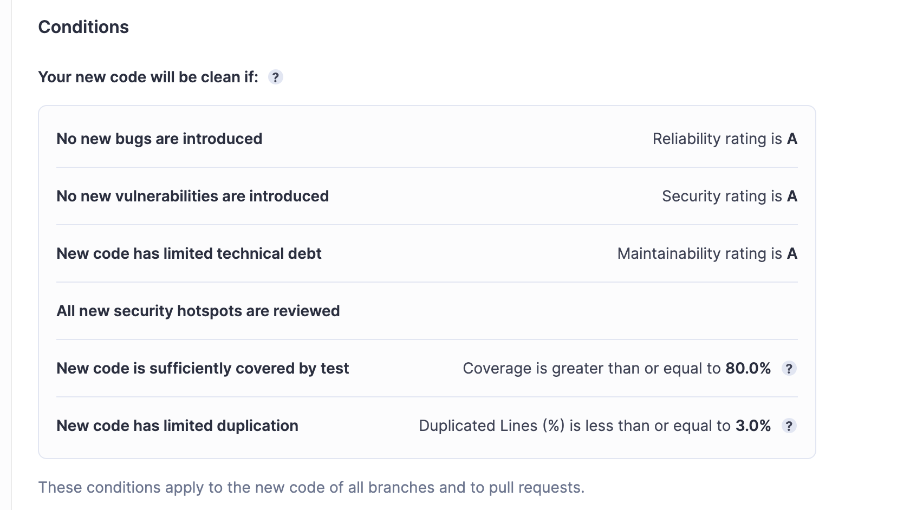

# TP partie 01

> **1-1 Documentez les éléments essentiels de votre conteneur de base de données : commandes et Dockerfile.**

## **Dockerfile**

```Dockerfile
# Image de base
FROM postgres:14.1-alpine
```

```Dockerfile
# Variables d'environnement
ENV POSTGRES_DB=db \
    POSTGRES_USER=usr \
    POSTGRES_PASSWORD=pwd
```

```Dockerfile
# Copie des scripts d'initialisation
COPY ./init-db-scripts/ /docker-entrypoint-initdb.d/
```

```Dockerfile
# Exposition du port
EXPOSE 5432
```

```Dockerfile
# Installation de packages, configuration du fuseau horaire et suppression de tzdata après installation
RUN apk add --no-cache \
    bash \
    vim \
    tzdata \
    && cp /usr/share/zoneinfo/Europe/Paris /etc/localtime \
    && echo "Europe/Paris" > /etc/timezone \
    && apk del tzdata
```

```Dockerfile
# Changement des autorisations et lien symbolique
RUN chmod 777 /usr/local/bin/docker-entrypoint.sh \
    && ln -s /usr/local/bin/docker-entrypoint.sh /
```

```Dockerfile
# Définition du volume pour persistance des données
VOLUME ["/var/lib/postgresql/data"]
```

## **Script run.sh**

### PostgreSQL

```bash
# Création d'un réseau Docker
docker network create app-network > /dev/null;
```

```bash
# Arrêt et suppression du conteneur PostgreSQL si existant
docker stop postgres > /dev/null;
docker rm postgres > /dev/null;
```

```bash
# Construction de l'image PostgreSQL avec le Dockerfile
docker build -t postgres . --no-cache > /dev/null
```

```bash
# Démarrage du conteneur PostgreSQL en mode détaché avec le nom 'postgres' et exposition du port 5432
docker run -d -p 5432:5432 --name postgres postgres > /dev/null
```

### Adminer

```bash
# Arrêt et suppression du conteneur Adminer si existant
docker stop adminer > /dev/null;
docker rm adminer > /dev/null;
```

```bash
# Démarrage du conteneur Adminer en mode détaché, lié au conteneur PostgreSQL, et exposition du port 9090
docker run -d --link postgres:db -p 9090:8080 --name adminer adminer > /dev/null
```

> **1-2 Pourquoi avons-nous besoin d'une construction en plusieurs étapes ? Et expliquez chaque étape de ce fichier docker.**

On construit en plusieurs étapes pour optimiser la taille de l'image Docker finale.
On sépare les phases de construction de l'application de la phase d'exécution. On réduit la taille de l'image finale en n'incluant que les artefacts nécessaires à l'exécution de l'application, sans conserver les outils de construction ni les fichiers temporaires.

> **1-3 Documenter les commandes les plus importantes de docker-compose.**

`docker-compose up` : Démarre les services\
`docker-compose down` : Arrêter et supprimer les ressources\
`docker-compose ps` : Afficher l'état des services\
`docker-compose logs` : Afficher les journaux\
`docker-compose exec` : Exécuter une commande dans unservice\
`docker-compose build` : Construire les images\
`docker-compose pull` : Télécharger les images\
`docker-compose restart` : Redémarrer les services

> **1-4 Documenter votre fichier docker-compose.**

- `version: '3.7'` : Spécifie la version de la syntaxe Docker Compose utilisée
- `services : Section définissant les services`
  - `backend`
    - `build: backend/.` : Construit l'image du backend à partir du dossier backend/.
    - `container_name: backend` : Nomme le conteneur "backend"
    - `networks: app-network` : Connecte le conteneur au réseau "app-network"
    - `depends_on: database, httpd` : Permet d'attendre que les services database et httpd soient lancés avant de démarrer le backend
  - `database`
    - `ports: "5432:5432"` : Map le port 5432 de l'hôte au port 5432 du conteneur
    - `build: db/.` : Construit l'image de la base de données à partir du dossier db/.
    - `container_name: postgres` : Nomme le conteneur "postgres"
    - `networks: app-network` : Connecte le conteneur au réseau "app-network"
  - `httpd`
    - `ports: "80:80"` : Map le port 80 de l'hôte au port 80 du conteneur
    - `build: webserver/.` : Construit l'image du serveur web à partir du dossier webserver/.
    - `container_name: webserver` : Nomme le conteneur "webserver"
    - `networks: app-network` : Connecte le conteneur au réseau "app-network"
  - `networks` : Section définissant le réseau "app-network"
    - `app-network` : Un réseau défini pour connecter les services

> **1-5 Documentez vos commandes de publication et les images publiées dans dockerhub.**

`docker login -u <usr>` puis entrer un access token : Connexion à Docker Hub\
`docker compose build` : Construction des images Docker\
`docker image ls` : Voir la liste des images Docker\
`docker tag <img_name>:<version> <usr>/<img_name>:<version>` : Tag de l'image\
`docker push <usr>/<img_name>:<version>` : Publication de l'image\

# TP partie 02

> **2-1 Qu'est ce que testcontainers ?**

_Testcontainers_ est une bibliothèque Java qui rationalise les tests d'intégration avec des instances légères et jetables de bases de données, de navigateurs web et d'autres services dans des conteneurs Docker. On peut ainsi faire des tests d'intégrations facilement en contactant des instances de containers de manière rapide et légère dans l'instance de CI.

**Avantages:**

```
* Simplifier de la gestion des containers
* Faciliter les scénarios de tests
* Accélérer des cycles de dvp.
* Améliorer de la fiabilité des tests pour les applications ayant des dépendances externes
```

> **2-2 Documentez vos configurations Github Actions**

**Définit le nom du workflow**

```yml
name: CI devops 2023
```

---

**Indique que ce workflow sera déclenché quand on push sur main**

```yml
on:
  push:
    branches: main
```

---

**Définit un job nommé "Test de l'application Spring" qui s'exécute sur `Ubuntu 22.04`**\
**Commence la liste des étapes à exécuter pour ce travail**

```yml
jobs:
  test-backend:
    name: "Test de l'application Spring"
    runs-on: ubuntu-22.04
    steps:
```

---

**Récupère le code du référentiel GitHub dans l'environnement de travail**

```yml
- uses: actions/checkout@v2.5.0
```

---

**Utilise l'action `setup-java@v3` pour configurer `JDK 17` avec la distribution `Temurin`**

```yml
- name: Set up JDK 17
  uses: actions/setup-java@v3
  with:
    java-version: "17"
    distribution: "temurin"
```

---

**Sélection du répertoire de travail `./backend/simpleapi`**\
**Exécute la commande Maven `mvn clean verify` pour nettoyer, compiler et tester le projet**

```yml
- name: Build and test with Maven
  working-directory: ./backend/simpleapi
  run: mvn clean verify
```

---

**Définit un job nommé "Construction et publication de l'image Docker" qui dépend du travail test-backend et s'exécute sur `Ubuntu 22.04`**\
**Commence la liste des étapes à exécuter pour ce travail**

```yml
build-and-push-docker-image:
  name: "Build and push Docker image"
  needs: test-backend
  runs-on: ubuntu-22.04
  steps:
```

---

**Utilise l'action `checkout@v2.5.0` pour récupérer à nouveau le code source du référentiel GitHub**

```yml
- name: Checkout code
  uses: actions/checkout@v2.5.0
```

---

**Exécute la commande `docker login` avec les noms d'utilisateur et les tokens d'accès.**

```yml
- name: Login to DockerHub
  run: docker login -u ${{ secrets.DOCKERHUB_USERNAME }} -p ${{ secrets.DOCKERHUB_TOKEN }}
```

---

**Utilise l'action `docker/build-push-action@v3` pour construire et pousser l'image Docker à partir du répertoire `./backend`**\
**L'image est taguée avec le nom d'utilisateur de DockerHub provenant des secrets et la version `1.0.0`**\
**L'image n'est publiée que si la référence GitHub est `refs/heads/main`**

```yml
- name: Build image and push backend
  uses: docker/build-push-action@v3
  with:
    context: ./backend
    tags: ${{secrets.DOCKERHUB_USERNAME}}/devops-backend:1.0.0
    push: ${{ github.ref == 'refs/heads/main' }}
```

---

**Utilise l'action docker/build-push-action@v3 pour construire et pousser l'image Docker à partir du répertoire `./db`**\
**L'image est taguée avec le nom d'utilisateur de DockerHub provenant des secrets et la version `1.0.0`**\
**L'image n'est publiée que si la référence GitHub est `refs/heads/main`**

```yml
- name: Build image and push database
  uses: docker/build-push-action@v3
  with:
    context: ./db
    tags: ${{secrets.DOCKERHUB_USERNAME}}/devops-database:1.0.0
    push: ${{ github.ref == 'refs/heads/main' }}
```

---

**Utilise l'action docker/build-push-action@v3 pour construire et pousser l'image Docker à partir du répertoire `./webserver`**\
**L'image est taguée avec le nom d'utilisateur de DockerHub provenant des secrets et la version `1.0.0`**\
**L'image n'est publiée que si la référence GitHub est `refs/heads/main`**

```yml
- name: Build image and push httpd
  uses: docker/build-push-action@v3
  with:
    context: ./webserver
    tags: ${{secrets.DOCKERHUB_USERNAME}}/devops-httpd:1.0.0
    push: ${{ github.ref == 'refs/heads/main' }}
```

---

> **2-3 Documentez la configuration de votre quality gate**



Chacun de nos critères doit prétendre à une note qui ne doit pas être inférieure à A.

La couverture de test doit être supérieur ou égale à 80% et le taux de duplication doit être inférieure à 3%.

Si une de ces conditions n'est pas respéctée, l'étape de quality gate dans la CI échoue.
